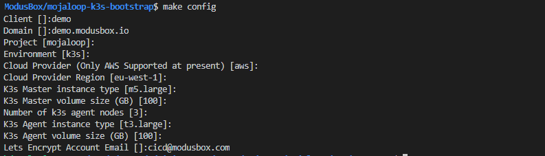

# Mojaloop K3S Bootstrap
A minimal PoC of mojaloop running on k3s

## Includes
- ingress controller (nginx-ingress, ambassador or traefik)
- external-dns (Automatic DNS registration in the configured domain)
- cert-manager (Automatic SSL Cert creation using LetsEncrypt)
- longhorn (Distrbuted storage driver)
- gitlab (CI/CD within the deployed system)
- wireguard (for VPN)
- mojaloop (Deployed with default mojaloop helm chart)

## Instructions for use

### Prerequisites
- awscli must be installed and configured for creating infrastructure and terraform backend. This
  is available in the package repos of most Linux distributions. Ensure you're using v2:
  ```sh
  $ aws --version
  aws-cli/2.1.17 # blah blah
  ```
- Ensure you have [AWS access keys (for IAM users)](https://docs.aws.amazon.com/general/latest/gr/aws-sec-cred-types.html#access-keys-and-secret-access-keys)
  configured in your environment with:
  ```sh
  $ aws configure
  ```
- GNU Make 4.x is required. By default, MacOS ships with Make 3.x, see (https://stackoverflow.com/questions/43175529/updating-make-version-4-1-on-mac) for details. Check with
  ```sh
  make --version
  ```
- Terraform >= 0.13.5. Find this in your package manager, or use `make install-terraform` to install in this directory.
- Ansible

### Bootstrap a new environment
- Clone this repo
  ```sh
  git clone https://github.com/modusintegration/mojaloop-k3s-bootstrap
  ```
- Perform initial configuration;
  ```sh
  make config
  ```
  Enter any required values, or accept the given defaults:

  

- Create the terraform backend;
  ```sh
  make backend
  ```
- Initialise terraform (this will also install the required version of terraform and the ansible terraform provider if needed)
  ```sh
  make init
  ```
- Create the infrastructure;
  ```sh
  make apply
  ```
- Install k3s, ingress controller, external-dns and cert-manager
  ```sh
  make k3s
  ```
- Destroy complete infrastructure

  First, disconnect VPN
  ```sh
  find wireguard.clients -name '*.conf' -exec sudo wg-quick down \{\} \;
  ```
  Then
  ``` sh
  make destroy
  ```
- Above shows a basic lifecycle only, see a full list of targets available for installation by running
  ```sh
  make help
  ```

### Existing environment
- To run commands against an existing bootstrapped environment;
  - Checkout the repo
    - Note: If using WSL on windows, make sure to clone inside the WSL Shell so that permissions are preserved
    ```sh
    git clone https://<your gitlab url>/IaC/k3s-bootstrap.git [preferred repo directory]
    ```
  - Initialise terraform
    ```sh
    make init
    ```
  - Done!

### kubectl access
- To connect to the master and run kubectl/helm commands;
  You'll require the `ansible-inventory` utility, which is likely bundled with `ansible` for your OS/distribution.
  - From within the [above initialised repo](#Bootstrap-a-new-environment), run;
    ```sh
    make ssh-master
    ```
- To retrieve a `kubeconfig` file for local access to the cluster:

  Get VPN configs:
  ```sh
  make vpn
  ```
  Bring up VPN:
  ```sh
  sudo wg-quick up $PWD/wireguard.clients/client1.conf
  ```
  Get the kubeconfig file (could take up to a minute):
  ```sh
  make kubeconfig
  ```
  Access cluster:
  ```sh
  export KUBECONFIG=$PWD/kubeconfig
  kubectl get pods
  ```

### Bastion host
The bastion host is used as an SSH jump host only, there are no kubectl/helm cli tools available.


### Ansible playbooks
- Generally, all installation should be made available as make targets as per above, however if you need to deploy changes via ansible, or re-run a specific playbook, you can do so;
  - From within above initialised repo, run;
    ```sh
    make ansible-playbook -- <playbookname>.yml
    ```
    Note: Further additional arguments to ansible can be passed after the playbook name, e.g. tags or verbose flags for debugging
    ```sh
    make ansible-playbook -- k3s-infra.yml -t cert-manager -vvv
    ```
    
  - If you execute `make ansible-playbook` without additional arguments, a list of available playbooks will be displayed

## Monitoring Stack - EFK vs Loki
See [README-monitoring.md](docs/README-monitoring.md)

## OnPrem specific instructions
See [README-onprem.md](docs/README-onprem.md)

## Vault integration for payment manager
See [README-vault.md](docs/README-vault.md)


# TODO
- Move terraform module out to a seperate repo as a module which can be referenced
- Integrate keycloak for kubernetes RBAC
